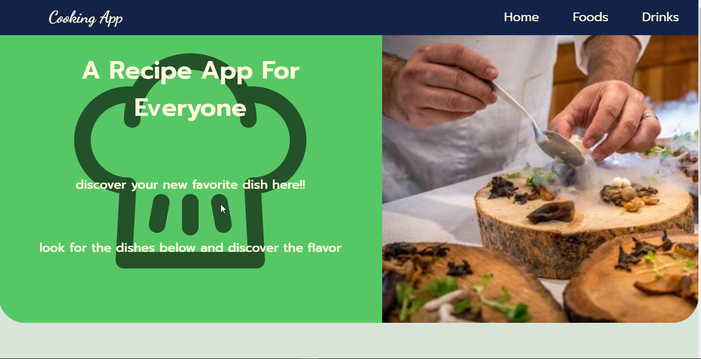
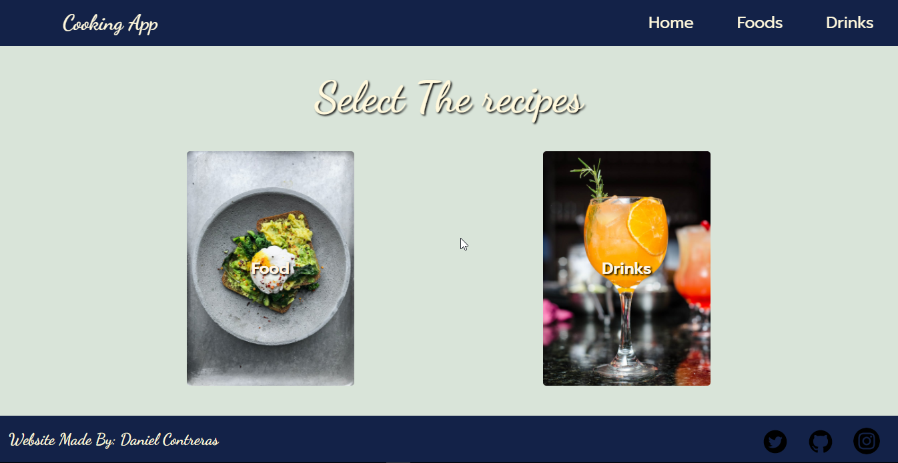

# Coocking App

Tier: 1-Beginner
Responsive: disable

## Overview

## Tecnologies

- 
- 
- 
- 
- 
- 
- 
- 
- 
- 
- 

## User Stories

- [x] User can see a list of recipe titles
- [x] User can click a recipe title to display a recipe card containing the recipe title, meal type (breakfast, lunch, supper, or snack), number of people it serves, its difficulty level (beginner, intermediate, advanced), the list of ingredients (including their amounts), and the preparation steps.
- [x] User click a new recipe title to replace the current card with a new recipe.

## Bonus Features

- [x] User can see a photo showing what the item looks like after it has been prepared.
- [x] User can search for a recipe not in the list of recipe titles by entering the meal name into a search box and clicking a 'Search' button. Any open source recipe API may be used as the source for recipes (see The MealDB below).
- [x] User can see a list of recipes matching the search terms
- [x] User can click the name of the recipe to display its recipe card.
- [x] User can see a warning message if no matching recipe was found.
- [x] User can click a 'Save' button on the cards for recipes located through the API to save a copy to this apps recipe file or database.
